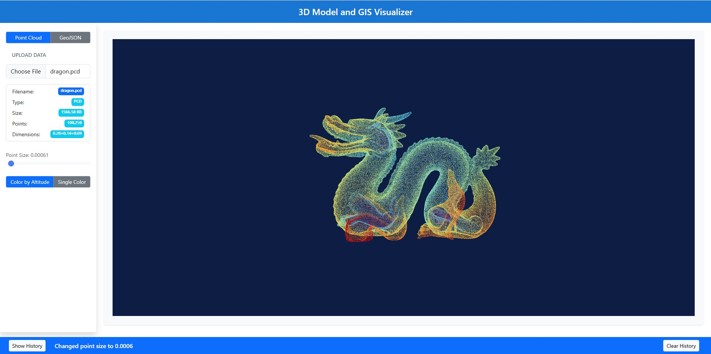

# 3D Model and GIS Visualizer  



## Overview  
A web-based application to visualize 3D point cloud data and GeoJSON maps. Users can upload .pcd, .xyz, and .geojson files to interactively explore and manipulate 3D models and GIS data.


## Features  
- Upload `.pcd`, `.xyz`, and `.geojson` files  
- **3D Viewer**: Rotate, zoom, change point size, and color  
- **GIS Viewer**: Pan, zoom, and view metadata  
- Switch between **Point Cloud** and **GeoJSON** modes  
- User activity tracking  

## Tech Stack  
- **Three.js** – 3D rendering  
- **OpenLayers** – GIS visualization  
- **React.js** – UI framework  

## Setup  
```sh
npm install  
npm start  
```

## Installation

1. Clone the repository:
    ```sh
    git clone https://github.com/rushiraval0/3d-data-viewer-with-GIS.git
    cd 3d-data-viewer-with-GIS
    ```

2. Install dependencies:
    ```sh
    npm install
    ```

3. Start the development server:
    ```sh
    npm start
    ```

4. Open your browser and navigate to `http://localhost:3000`.


## Usage  
1. Click **Point Cloud** or **GeoJSON** to select a mode.  
2. Upload a **.pcd**, **.xyz**, or **.geojson** file.  
3. **Interact** with the visualization:  
   - Rotate, zoom, and pan (for 3D models).  
   - Change point size (scroll) and color.  
   - View metadata below the upload section.  
4. **Switch modes** anytime.  
5. **Track user activity** in the footer.  
